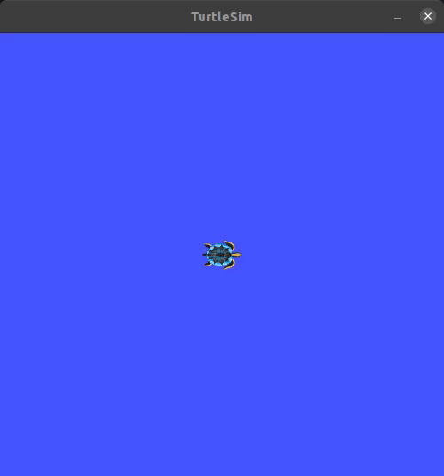

# TURTLE CONTROL
**Andru Liu**

## Overview
This package has a simulated turtle draw a series of waypoints and follow them while tracing out its path and returning the total distance traveled. The package depends on turtlesim, making use of the turtle and various messages and services from within the package. 

## Usage Instructions
To launch the package use the roslaunch command `roslaunch turtle_control run_waypoints.launch` 
This will initialize the turtlesim node. Then run the rosservice `rosservice call /restart "x: 1.0 y: 1.0" ` 
This service takes in an x and y input which can be within the bounds of [0, 10].

## Configuration Instructions: 
To adjust the waypoints the turtle will draw and follow use the `waypoints.yaml` file. The file can take any number of listed waypoints which will be launched. 

